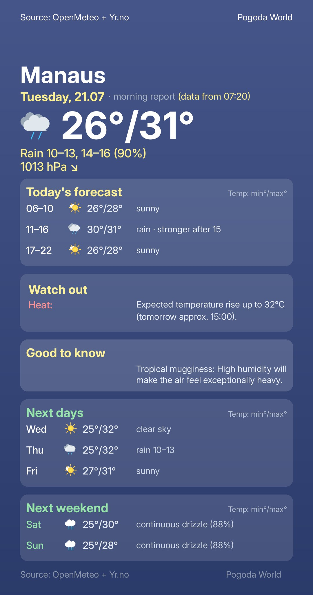
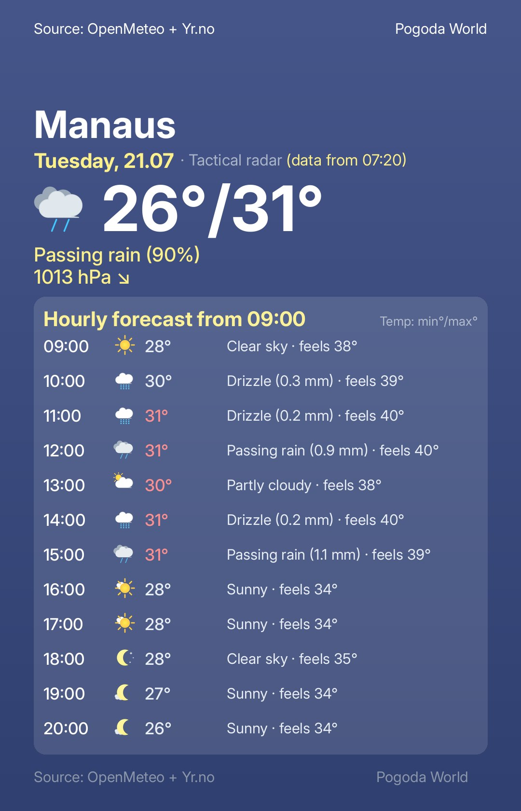
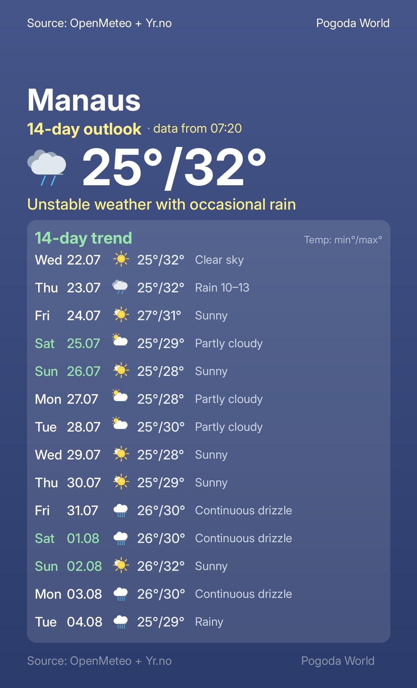

# 🌍 Pogoda World 🌤️

**Your personal intelligent weather assistant on Telegram.**

**Pogoda World** is an advanced weather bot that delivers beautiful, custom-generated visual cards with precise forecasts tailored to your exact location. Say goodbye to boring tables and misinformation—our system analyzes data from the best meteorological models (including the Norwegian **Yr.no**) and presents it in a clear, newspaper-style layout.

It utilizes **Artificial Intelligence (LLM / Groq API)** to generate natural-sounding summaries. However, the AI operates under strict supervision: it is only allowed to speak if its output successfully passes a rigid *"verification ladder"*, ensuring complete compliance with the raw meteorological data. The bot natively supports **6 languages** (**PL, EN, DE, FR, ES, NO**) and automatically adapts to your device's settings.

---

## 🚀 How to get started?

The application operates on a **closed community model** (limited slots to ensure the highest quality and speed of graphic generation).

*   **Get an invite:** Click the dedicated invitation link received from a Telegram current user, or use this ready-to-go invite link:  
    👉👉👉 `https://t.me/Twoja_pogoda_bot?start=ODM5NjgzMjgyMA`
*   **Set your location (New!):** Use the built-in, modern mini-app (**Telegram WebApp**) by pressing the **📍 Update with GPS** button, or use the traditional `/city` command.
*   **All set!** The bot will automatically detect your timezone, fetch the localized city name, and immediately send you your first personalized forecast.

---

## 🌟 Main Features

*   📰 **Daily Newspaper (Reports)** – Get the weather exactly when you need it. Set your custom times (e.g., 07:00 and 15:00) in the convenient control panel (`/menu`). The bot will proactively reach out to you with a beautiful, ready-to-read card.
*   ⚡ **Tactical Radar (`/now`)** – Leaving the house and unsure if you need an umbrella? The radar generates a card with a surgical forecast for the next 12 hours (flawlessly distinguishing drizzle from a downpour, and continuous snow from flurries!).
*   🔮 **14-Day Trend (`/future`)** – A hybrid, long-term forecast analyzing phenomena in a broader, two-week context.
*   ⚠️ **Smart Alerts** – An internal engine warns you of sudden pressure drops, damaging wind gusts, or poor air quality.
*   🌍 **Multilingual (i18n)** – The bot's interface, geographical names, and weather descriptions are translated on the fly into **PL, EN, DE, FR, ES, or NO**.
*   ✈️ **Vacation Mode (Auto-Timezone)** – Traveling? Use the GPS button from the other side of the world. The bot will automatically translate the new location, adjust your timezone, and deliver reports according to your new local time.

---

## 💻 Under the Hood (For Developers)

The code shared in this repository serves as a **public technology portfolio**. The application runs in a production environment 24/7 on a private **Oracle Cloud** server, handling user requests in a stateless model.  
*(API keys such as Telegram Token, Google Credentials, Groq API, and user data are strictly protected by `.env` environment variables and are not included in the repository).*

### 🏗️ Architecture and Main Technologies

*   **Language:** Python 3.10+
*   **Card Rendering (UI):** `Pillow (PIL)` library - a custom, pixel-perfect engine that draws rounded tiles, adds shadows, intelligently wraps text, and positions dynamic weather icons.
*   **Frontend Application (WebApp):** Native integration with `Telegram WebApp` (HTML/Vanilla JS) allowing instant and secure transmission of GPS coordinates straight into the Python environment.
*   **Data Aggregator:** Parallel, asynchronous API polling from **Yr.no** (Norwegian Meteorological Institute) and **Open-Meteo**. The engine selects optimal data or merges them in a hybrid way.
*   **Database (DRY Principle):** Google Sheets API (`gspread`). A Google Sheet acts as a flexible CRM system (easy database overview). The bot features a built-in **Smart Auto-Cleanup** to automatically purge inactive accounts from the database.
*   **Deterministic Text Engine & AI:** Instead of relying on raw WMO codes, the application calculates precipitation millimeters, pressure, and cloud layers on the fly via a cross-classifier. This guarantees 100% consistency between the text description and the presented icons, with simultaneous LLM support for stable forecasts.

    
    
  

---

> *Built with passion for meteorology, UX, and clean code.* ☁️☀️